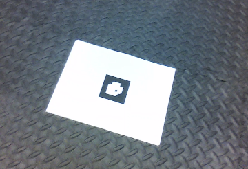
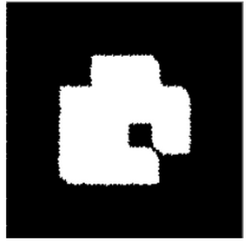
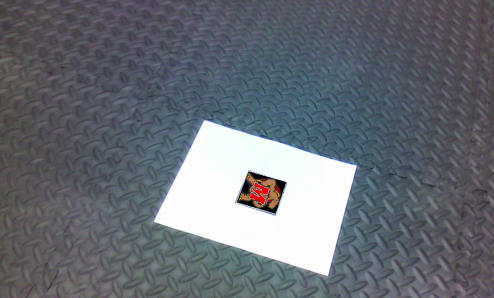
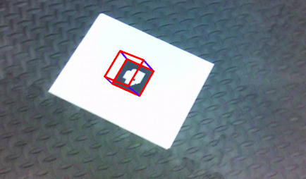

# AR-tag-Detection-And-Tracking
This project will focus on detecting a custom AR Tag (a form of fiducial marker),
that is used for obtaining a point of reference in the real world, such as in
augmented reality applications. There are two aspects to using an AR Tag, namely
detection and tracking, both of which will be implemented in this project. The
detection stage will involve finding the AR Tag from a given image sequence while
the tracking stage will involve keeping the tag in “view” throughout the sequence
and performing image processing operations based on the tag’s orientation and
position (a.k.a. the pose).

Checkout [this report](https://github.com/savnani5/AR-tag-Detection-And-Tracking/blob/main/ENPM673-%20PROJ1.pdf) for detialed explanation of detection, tracking of the tag and superimposing over it.

---
## Detection 
**INPUT DATA**

    

1. Initially, the user is prompted to enter the number to play a specific video
for the code.
2. Then, the testudo image and corresponding video is loaded and the testudo
is resized to a smaller size to avoid more number of multiplications when
warping the image
3. In the main while loop, the frames are received from the video and resized
to 70% to increase the playback speed, also it is then grayscaled to do
image processing operations.
4. Further aggressive thresholding is done, and noise is removed using the
opening morphological operation with a custom 5*5 averaging kernel.
5. Next step is to find contours on the output image and use hierarchy matrix
to narrow out the AR tag.
6. The hierarchy matrix gives the following list for each contour ([Next,
Previous, First_Child, Parent]), we try to get the second child for each use
case as the AR tag contour( assuming boundary of the frame as the parent
contour).
7. If multiple second children are found then it means it's the multiple Tags
video else, it is a single tag video.
8. So, after getting the second child list, we iterate through it and approx the
second child contour with cv2.approxPolyDP function with the epsilon
value to get four points.
9. So, we get the destination points from the approx contour and we generate
source points from the shape of the testudo in arbitrary order.
10. Now, if we get 4 destination points, we find the bounding box around them
and shift the destination points in accordance to the new bounding box
and input them with a new sliced image into the orientation detection
function.
11.This function returns the current orientation of the AR tag, its ID, itsthreshold image and the actions required to correct the arbitrary source
points to align the testudo.
12.We correct the source points list by left shifting them according to the
actions list.
13.Next, we input original destination points and the corrected source points
to get the homography matrix (H).
14.Finally, we input this H matrix in the custom warp perspective function
with testudo and image frame as parameters, and we display the frame.

**Warped AR tages**

   

### Tracking and Superimposing

     


1. Problem *Two_b.py* is an extension of the the 2a problem, initially it also prompts
the user to choose the video to run and it defines the K matrix (intrinsic
parameters of the camera).
2. Next piece of code is similar to the part Two_a, where the 4 corners are
detected with orientation and id of the AR tag.
3. Furthermore, for this problem we calculate the Projection Matrix(P), for
that we have to decompose the H matrix into Rotation and Translation
matrix.
4. We calculate the B matrix as:

    ```B = λ*(K^-1)*H```
    
    
5. We find the scaling factor ( λ ) using the formula:

    ```λ=(||(K^-1) h_1 || + || (K^-1)*h_2 ||)^-1/2```
    
    
6. Now, we can compute the rotation and translation matrices using the
following equations:

    ```r1 = λb1```
    ```r2 = λb2```
    ```r3 = r1 x r2```
    ```t = λb3```

7. Finally, we compute the Projection Matrix as:

    ```P = K [R|t]```

8. To get the Z coordinates of the cube we multiply the Projection Matrix with
the homogeneous source points with negative z values(as the top left
corner of the cube is taken as origin).

9. A very rudimentary version of Kalman filter is applied on the z_points and
the KF.predict() and KF.update() methods are called to get the points after
the filter.

10. Next, we draw the edges of the cube to visualize it in 3 dimensions.

     

---
## Input

[Input Data](https://drive.google.com/drive/folders/1b_cSKQp5dlNqVjAsJskwU_5_8V1B5Uq1?usp=sharing)


## Output

[Output Videos](https://drive.google.com/drive/folders/19yLQtRxngrrmcS1Lgx9lMOd856wHkDdb?usp=sharing)

---
## How to Run the Code

1) Change the path of the input videos in the video list

    ```PY
    video_list = ['Tag0.mp4', 'Tag1.mp4', 'Tag2.mp4', 'multipleTags.mp4']
    ```

2) Run the following command for the image superimpostion.
  
    ```python Two_a.py```
  
3) Run the following command for the cube superimposition.

    ```python Two_b.py```

---
## References
1) https://math.stackexchange.com/questions/494238/how-to-compute-homography-matrix-h-from-corresponding-points-2d-2d-planar-homog
2) https://www.geogebra.org/?lang=en
3) https://math.berkeley.edu/~hutching/teach/54-2017/svd-notes.pdf
4) https://opencv-python-tutroals.readthedocs.io/en/latest/py_tutorials/py_imgproc/py_contours/py_table_of_contents_contours/py_table_of_contents_contours.html#table-of-content-contours
5) https://docs.opencv.org/master/de/dbc/tutorial_py_fourier_transform.html
6) ENPM 673, Robotics Perception - Theory behind Homography Estimation
7) CSCE 441: Computer Graphics - Image Warping - Jinxiang Chai
8) https://machinelearningspace.com/2d-object-tracking-using-kalman-filter/


